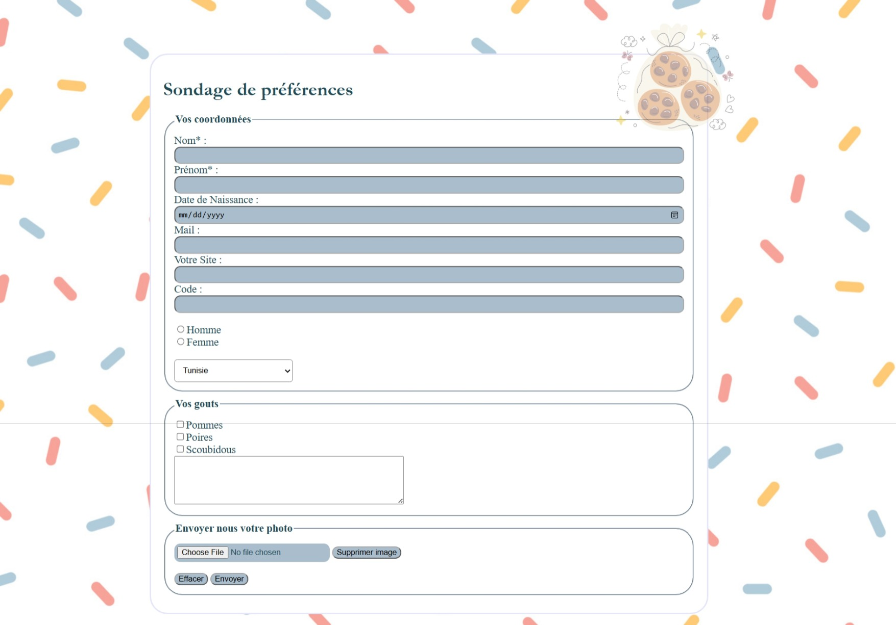

# Preference survey for a bakery 🍰

## Description
Static HTML/CSS site created initially to learn how to create and style a HTML form and CSS animation.
I decided to design a sweet form that's why I chose the concept of a bakery. (or maybe was craving a piece of cake😅.)

This project was created for a university assignment as a part of the web-development course.
This is one of the early projects in the course. The purpose of sharing it is to see my progress in the future.

## Screenshots

## License
** For educational purposes only **

